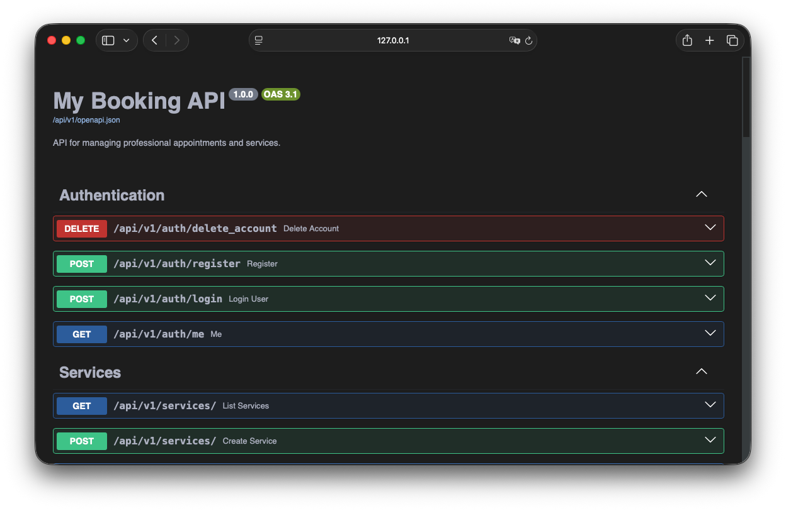
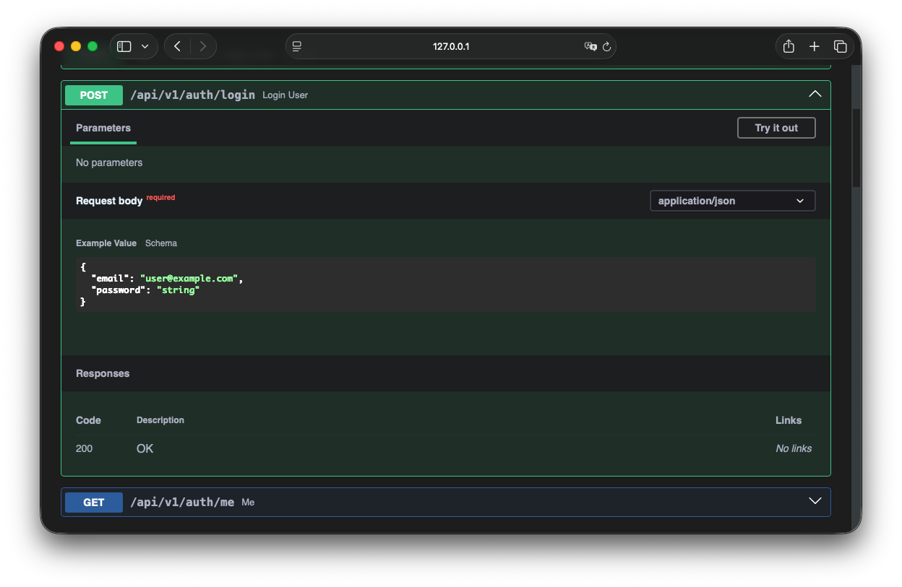
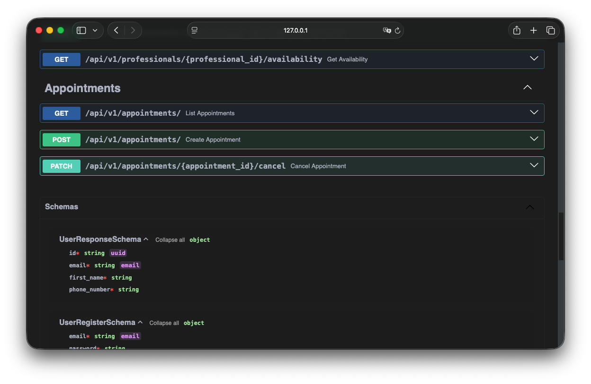

# Swagger Dark Mode

While developing a Django Ninja backend, I noticed that the Swagger UI lacked a native dark mode. To solve this, I created custom CSS styles to provide a dark theme experience.

This project originated as a private repository, and I created this public repository solely to share these styles.

## Usage

The CSS file is located at `static/swagger/swagger-dark.css`.

To use it, import the default `swagger-ui.css` and then add the custom dark theme stylesheet immediately below it to override the default styles:

```html
<link
  rel="stylesheet"
  href="https://unpkg.com/swagger-ui-dist/swagger-ui.css"
/>
<link rel="stylesheet" href="/static/swagger/swagger-dark.css" />
```

## Preview




